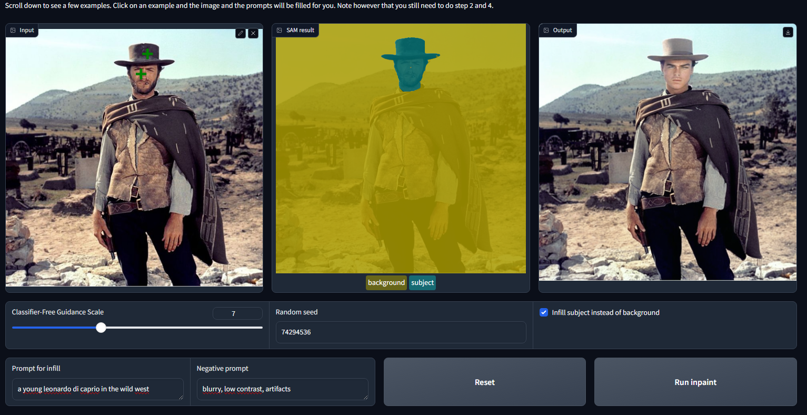
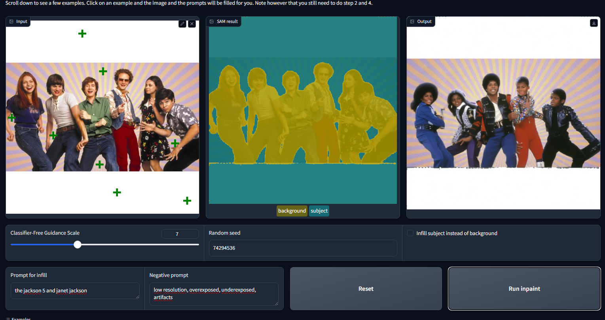

# 1 - Project Overview
-    ### 1.1 - Project Introduction
     Generative models can be used in Computer Vision.  Here we will use the Meta Segment Anything Model (SAM) to select subjects in images by providing points and other inputs.

     Also we have an app able to swap the backgroupd of an image nd susbstitute it with a computer-generated one described through text.

-    ### 1.2 - Project Summary
     Our goal is to do an app that allows the selection of a subject and then change its background, OR keep the background and change the subject.

     The process involves a user uploading an image and selecting the main object by clicking on it. The Segment Anything Model (SAM) is activated to create a mask around the selected object, choosing the most accurate mask generated. The user is shown this result to either accept it or refine the mask further with additional points. Once the mask is finalized, the user gives a text description (and possibly a negative prompt) to specify a new background for the selected object. An infill model then creates this new background, and the final image is displayed. Optionally, the user can choose to invert the mask and substitute the subject while keeping the background, as in the example above.

     The goal of the application is to swap backgrounds, swap subjects, remove objects, and more!

     The main goal of the notebook is to write the basic functionality of the app: calling the SAM model and processing its output, as well as using a text2image diffusion model to generate the new background or subject.

## 2 - Project Instructions
- Load the Jupyter notebook.
- Follow the instructions contained there step by step running each line.
- The gradio app allows an interactive experience as is on the results images below in four (4). We will be able to start it from within the notebook. Then, by clicking on a link, you will be taken to a new tab with the gradio UI available for use.
- I suggest you to improve the results changing the Classifier-Free Guidance Scale (CFGS) or the random seed - which you now understand - and see which results you get.

## 3 - App instructions
- When finished the notebook, the app will be launched and can be excecuted via the link or inside the noteboook.

 <b>4 - Results<b>

Some images that exemplify the results of the notebook
- From Clint Eastwood to Leonardo Di Caprio

- From That 70's Show to The Jackson's 5

 

 <b>Issues<b>

- no issues found yet.

 <b>Future Work<b>

- None

 <b>Contributing<b>

Your contributions are always welcome! Please feel free to fork and modify the content but remember to finally do a pull request.

 :iphone: <b>Having Problems?<b>

 

 <b>License<b>

